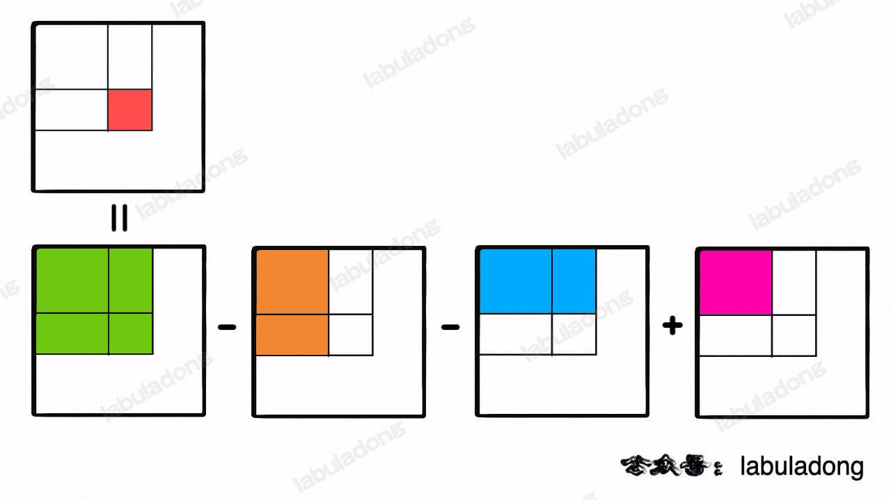

* 前缀和技巧适用于快速、频繁地计算一个索引区间内的元素之和
核心思路就是创建一个新的数组preSum，preSum[i]记录nums[0...i-1]的累加和
如果我想求索引区间 [1, 4] 内的所有元素之和，就可以通过 preSum[5] - preSum[1] 得出。


* 进阶:二维数组的前缀和
力扣链接：https://leetcode.cn/problems/range-sum-query-2d-immutable/description/

```js
var NumMatrix = function(matrix) {
    var m = matrix.length, n = matrix[0].length;
    if (m === 0 || n === 0) return;
    // 构造前缀和矩阵
    this.preSum = new Array(m + 1).fill(null).map(() => new Array(n + 1).fill(0));
    for (var i = 1; i <= m; i++) {
        for (var j = 1; j <= n; j++) {
            // 计算每个矩阵 [0, 0, i, j] 的元素和
            this.preSum[i][j] = this.preSum[i-1][j] + this.preSum[i][j-1] + matrix[i - 1][j - 1] - this.preSum[i-1][j-1];
        }
    }
};

// 计算子矩阵 [x1, y1, x2, y2] 的元素和
NumMatrix.prototype.sumRegion = function(x1, y1, x2, y2) {
    // 目标矩阵之和由四个相邻矩阵运算获得
    return this.preSum[x2+1][y2+1] - this.preSum[x1][y2+1] - this.preSum[x2+1][y1] + this.preSum[x1][y1];
    
};


```